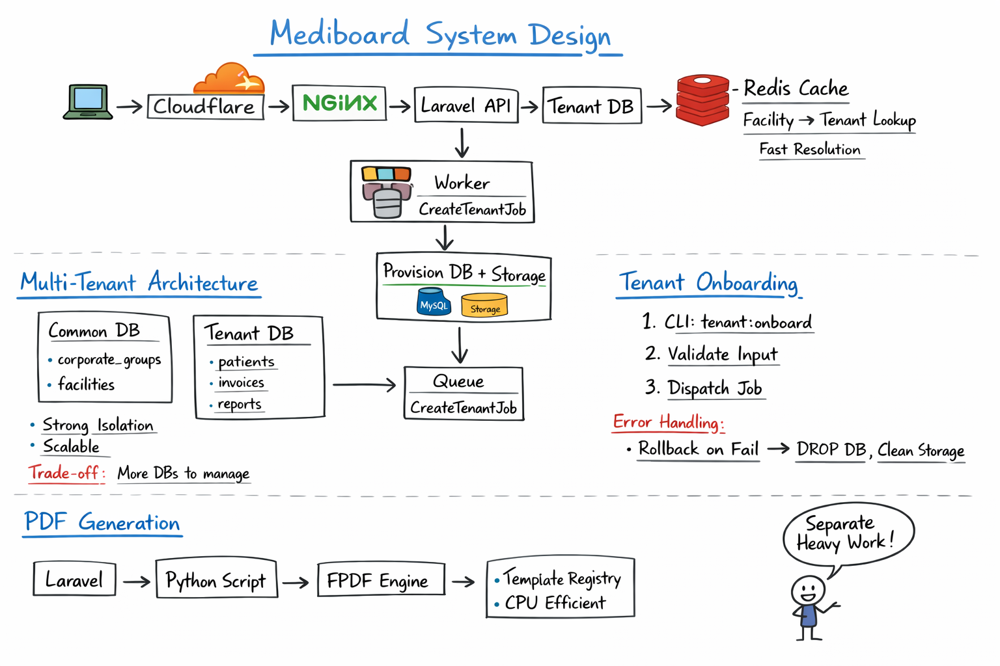

# Mediboard - System Design & Architecture

Mediboard is a multi-tenant healthcare management platform designed for clinics, labs, and healthcare providers. It supports patient management, consultations, lab reports, prescriptions, billing, and communication workflows.

This repository documents the **system design, architecture, and engineering decisions** behind the platform.

📌 This repository follows a structured documentation approach.
All detailed design documents are available under the `/docs` directory.

---

## Architecture Diagrams

### 1. Simple View

---

## 🚀 Core Capabilities

- Multi-tenant architecture (per-tenant data isolation)
- Clinical workflows (appointments, consultations, prescriptions)
- Lab management system with structured + panel tests
- PDF report generation using Python (FPDF-based)
- Inventory and billing system
- Communication layer (Email + WhatsApp)
- Redis-backed caching and session management
- Cron-based maintenance (cleanup, permissions)

---

## 🧱 Tech Stack

| Layer | Technology |
|------|------------|
| Backend API | Laravel (PHP) |
| Report Engine | Python (FPDF, QR, MySQL connector) |
| Database | MySQL (tenant + common schemas) |
| Cache / Session | Redis |
| Storage | Local FS (`/storage`) |
| Queue | Laravel Queue (sync / extensible) |
| Cron | Linux crontab (`www-data`) |

---

## 📂 Documentation

### 🏗️ Architecture
- [System Design](docs/SYSTEM_DESIGN.md)
- [Architecture](docs/ARCHITECTURE.md)

### 🧱 Core Engineering
- [Database](docs/DATABASE.md)
- [Tenant Resolution](docs/TENANT_RESOLUTION.md)
- [Queue Architecture](docs/QUEUE_ARCHITECTURE.md)

### ⚙️ Integrations
- [Integration](docs/INTEGRATION.md)
- [Python Integration](docs/PYTHON_INTEGRATION.md)

### 🛡️ Reliability & Security
- [Failure Handling](docs/FAILURE_HANDLING.md)
- [Security](docs/SECURITY.md)

### 🔧 Configuration
- [Environment Variables](docs/ENVIRONMENT_VARIABLES.md)
- [Decisions](docs/DECISIONS.md)

---

## 🧠 Design Principles

- Strict separation of concerns (API vs processing vs storage)
- Tenant isolation at database + filesystem level
- Deterministic execution for report generation (CLI-based Python)
- Redis-first caching for high-read endpoints
- Fail-safe background operations (cron + logs + rotation)
- Config-driven behavior via `.env` and feature flags

---

## 📌 Key Highlights

- Python used deliberately for **CPU-bound PDF generation**
- Hybrid architecture (Laravel + Python) for **performance + flexibility**
- JSON columns used selectively for **semi-structured medical data**
- Storage abstraction supports future migration to S3/CloudFront

---

---

## 🧪 How to Explore This Repository

1. Start with `SYSTEM_DESIGN.md` for a high-level overview
2. Dive into `ARCHITECTURE.md` for component breakdown
3. Review `DECISIONS.md` to understand trade-offs
4. Explore `SECURITY.md` for production considerations

---

## 🎯 Intended Audience

This repository is designed for:
- Backend engineers
- System design interview preparation
- Multi-tenant SaaS architecture learning